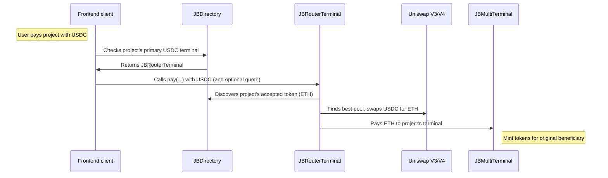

# nana-router-terminal-v6

A Juicebox terminal that accepts payments in any token, dynamically discovers what token each destination project accepts, and routes the payment there — via direct forwarding, Uniswap swap, JB token cashout, or a combination. Supports both Uniswap V3 and V4 pools, choosing whichever offers better liquidity.

_If you're having trouble understanding this contract, take a look at the [core protocol contracts](https://github.com/Bananapus/nana-core-v6) and the [documentation](https://docs.juicebox.money/) first. If you have questions, reach out on [Discord](https://discord.com/invite/ErQYmth4dS)._

## Architecture

| Contract | Description |
|----------|-------------|
| `JBRouterTerminal` | Core terminal. Accepts any token via `pay` or `addToBalanceOf`, discovers the destination project's accepted token, and routes there — swapping through Uniswap V3 or V4 pools if needed. Uses TWAP oracle for automatic slippage protection when the caller doesn't provide a quote. |
| `JBRouterTerminalRegistry` | A proxy terminal that delegates `pay` and `addToBalanceOf` to a per-project or default `JBRouterTerminal` instance. Allows project owners to choose (and lock) which router terminal implementation they use. |

## How It Works

1. A payer calls `pay(projectId, token, amount, ...)` with any token.
2. The terminal accepts the token (supports ERC-20 approvals and Permit2).
3. It discovers the destination project's accepted token by querying the directory.
4. If the input token differs from the accepted token, it finds the best pool across Uniswap V3 and V4, comparing multiple fee tiers.
5. Slippage protection: the caller can pass a minimum output quote in metadata (`quoteForSwap` key), or the terminal calculates one from the pool's TWAP oracle with dynamic slippage tolerance.
6. The output tokens are forwarded to the project's primary terminal via `terminal.pay(...)` or `terminal.addToBalanceOf(...)`.



### Routing Strategies

The terminal can route payments via multiple strategies:

- **Direct forwarding** — If the input token is already accepted by the destination terminal.
- **Uniswap V3 swap** — Through the highest-liquidity V3 pool across fee tiers (0.01%, 0.05%, 0.3%, 1%).
- **Uniswap V4 swap** — Through V4 pools, also searching multiple fee/tick-spacing configurations.
- **JB token cashout** — Redeeming JB project tokens to get the needed output token.
- **Combination** — Chaining strategies when no single route works.

## Install

For projects using `npm` to manage dependencies (recommended):

```bash
npm install @bananapus/router-terminal-v6
```

For projects using `forge` to manage dependencies:

```bash
forge install Bananapus/nana-router-terminal-v6
```

If you're using `forge`, add `@bananapus/router-terminal-v6/=lib/nana-router-terminal-v6/` to `remappings.txt`.

## Develop

`nana-router-terminal-v6` uses [npm](https://www.npmjs.com/) (version >=20.0.0) for package management and [Foundry](https://github.com/foundry-rs/foundry) for builds and tests.

```bash
npm ci && forge install
```

| Command | Description |
|---------|-------------|
| `forge build` | Compile the contracts and write artifacts to `out`. |
| `forge test` | Run the tests. |
| `forge fmt` | Lint. |
| `forge build --sizes` | Get contract sizes. |
| `forge coverage` | Generate a test coverage report. |
| `forge clean` | Remove the build artifacts and cache directories. |

### Scripts

| Command | Description |
|---------|-------------|
| `npm test` | Run local tests. |
| `npm run coverage` | Generate an LCOV test coverage report. |

### Configuration

Key `foundry.toml` settings:

- `solc = '0.8.26'`
- `evm_version = 'cancun'` (required for Uniswap V4's transient storage)
- `optimizer_runs = 100000000`

## Repository Layout

```
nana-router-terminal-v6/
├── src/
│   ├── JBRouterTerminal.sol              # Core router terminal
│   ├── JBRouterTerminalRegistry.sol      # Per-project terminal routing
│   ├── interfaces/
│   │   ├── IJBRouterTerminal.sol         # Router terminal interface
│   │   ├── IJBRouterTerminalRegistry.sol # Registry interface
│   │   └── IWETH9.sol                    # WETH wrapper interface
│   ├── libraries/
│   │   └── JBSwapLib.sol                 # Swap math and pool discovery
│   └── structs/
│       └── PoolInfo.sol                  # Pool metadata struct
├── script/
│   ├── Deploy.s.sol                      # Deployment script
│   └── helpers/
│       └── RouterTerminalDeploymentLib.sol # Deployment address loader
└── test/
    ├── RouterTerminal.t.sol              # Terminal tests
    └── RouterTerminalRegistry.t.sol      # Registry tests
```

## Payment Metadata

The `JBRouterTerminal` accepts encoded `metadata` in its `pay(...)` function. Metadata is decoded using `JBMetadataResolver`:

```solidity
(bool exists, bytes memory quote) =
    JBMetadataResolver.getDataFor(JBMetadataResolver.getId("quoteForSwap"), metadata);

if (exists) {
    (minAmountOut) = abi.decode(quote, (uint256));
}
```

If no quote is provided, the terminal calculates one from the pool's TWAP oracle with a dynamic slippage tolerance based on the estimated price impact of the swap.

The terminal also supports Permit2 metadata (key: `"permit2"`) for gasless token approvals.

## Risks

- The terminal never holds a token balance. After every swap, all output tokens are forwarded and leftover input tokens are returned to the payer.
- Pool discovery is dynamic — the terminal searches V3 and V4 pools at runtime. If pool liquidity changes between discovery and execution, slippage protection prevents losses.
- TWAP fallback: when no TWAP observations exist, the terminal falls back to the pool's current spot tick rather than reverting.
- The `receive()` function only accepts ETH from the WETH contract (during unwrap). All other senders revert.
- Uniswap V4 requires `cancun` EVM version (transient storage opcodes). This terminal will not work on chains without EIP-1153 support.
