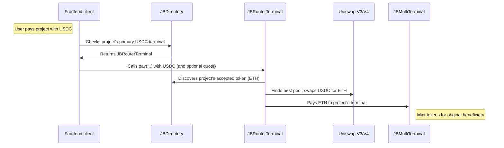

# Juicebox Router Terminal

A Juicebox terminal that accepts payments in any token, dynamically discovers what token each destination project accepts, and routes the payment there -- via direct forwarding, Uniswap swap, JB token cashout, or a combination. Supports both Uniswap V3 and V4 pools, choosing whichever offers better liquidity.

This contract family is a routing surface, not an accounting-truth surface. `JBRouterTerminal` synthesizes
`JBAccountingContext` values with `decimals = 18` for any token, and the registry simply forwards that context. Do not
reuse the router terminal or router terminal registry as an accounting-sensitive terminal source for lending or other
logic that relies on real token decimals.

_If you're having trouble understanding this contract, take a look at the [core protocol contracts](https://github.com/Bananapus/nana-core-v6) and the [documentation](https://docs.juicebox.money/) first. If you have questions, reach out on [Discord](https://discord.com/invite/ErQYmth4dS)._

## Architecture

| Contract | Description |
|----------|-------------|
| `JBRouterTerminal` | Core terminal. Accepts any token via `pay` or `addToBalanceOf`, discovers the destination project's accepted token, and routes there -- swapping through Uniswap V3 or V4 pools if needed, cashing out JB project tokens if the input is a project token, or forwarding directly if the token is already accepted. Uses TWAP oracle (V3) or spot price (V4) for automatic slippage protection when the caller does not provide a quote. Implements `IJBTerminal`, `IJBPermitTerminal`, `IUniswapV3SwapCallback`, and `IUnlockCallback`. |
| `JBRouterTerminalRegistry` | A proxy terminal that delegates `pay` and `addToBalanceOf` to a per-project or default `JBRouterTerminal` instance. Project owners can choose which router terminal they use, and optionally lock that choice permanently. Implements `IJBTerminal` via `IJBRouterTerminalRegistry`. |

## How It Works

1. A payer calls `pay(projectId, token, amount, ...)` with any token.
2. The terminal accepts the token (supports ERC-20 approvals, Permit2, and credit transfers).
3. If the input is a JB project token (ERC-20 or credits), it recursively cashes out through the source project's terminals until reaching a base token.
4. It resolves which token the destination project accepts, checking: metadata override (`routeTokenOut`), real direct acceptance proven by terminal accounting contexts, NATIVE/WETH equivalence, then dynamic pool discovery across all terminals.
5. If the resolved token differs from the input, it converts -- wrapping/unwrapping ETH/WETH, or swapping through the best Uniswap V3 or V4 pool.
6. Slippage protection: the caller can pass a minimum output quote in metadata (`quoteForSwap` key), or the terminal calculates one using TWAP (V3) or spot price (V4) with a dynamic sigmoid slippage tolerance based on estimated price impact.
7. The output tokens are forwarded to the project's primary terminal via `terminal.pay(...)` or `terminal.addToBalanceOf(...)`.



### Routing Strategies

The terminal uses a multi-step routing algorithm:

1. **JB token cashout** -- If the input is a JB project token (detected via `TOKENS.projectIdOf()` or the `cashOutSource` metadata key for credits), the terminal recursively cashes out through the source project's cashout terminals. At each step it prioritizes: tokens the destination directly accepts, then other JB tokens (recursable), then any base token.
2. **Direct forwarding** -- If the (possibly post-cashout) token is already accepted by the destination terminal.
3. **NATIVE/WETH equivalence** -- If the project accepts NATIVE_TOKEN and the input is WETH (or vice versa), wrap or unwrap.
4. **Uniswap swap** -- Through the highest-liquidity pool across V3 fee tiers (0.3%, 0.05%, 1%, 0.01%) and V4 fee/tick-spacing pairs. V3 and V4 compete on liquidity; the deeper pool wins.
5. **Combination** -- Chaining cashout + swap when no single route works.

### Token Output Resolution Priority

When deciding what token to convert to, `_resolveTokenOut` follows this order:

1. **Metadata override** -- Payer specifies `routeTokenOut` in metadata.
2. **Direct acceptance** -- The destination project accepts `tokenIn` as-is.
3. **NATIVE/WETH equivalence** -- The project accepts the wrapped/unwrapped form.
4. **Dynamic discovery** -- Iterate all terminals and accounting contexts for the project, find the accepted token with the deepest Uniswap pool against `tokenIn`.

## Install

For projects using `npm` to manage dependencies (recommended):

```bash
npm install @bananapus/router-terminal-v6
```

For projects using `forge` to manage dependencies:

```bash
forge install Bananapus/nana-router-terminal-v6
```

If you're using `forge`, add `@bananapus/router-terminal-v6/=lib/nana-router-terminal-v6/` to `remappings.txt`.

## Develop

`nana-router-terminal-v6` uses [npm](https://www.npmjs.com/) (version >=20.0.0) for package management and [Foundry](https://github.com/foundry-rs/foundry) for builds and tests.

```bash
npm ci && forge install
```

| Command | Description |
|---------|-------------|
| `forge build` | Compile the contracts and write artifacts to `out`. |
| `forge test` | Run the tests. |
| `forge fmt` | Lint. |
| `forge build --sizes` | Get contract sizes. |
| `forge coverage` | Generate a test coverage report. |
| `forge clean` | Remove the build artifacts and cache directories. |

### Scripts

| Command | Description |
|---------|-------------|
| `npm test` | Run local tests. |
| `npm run coverage` | Generate an LCOV test coverage report. |

### Configuration

Key `foundry.toml` settings:

- `solc = '0.8.26'`
- `evm_version = 'cancun'` (required for Uniswap V4's transient storage)
- `optimizer_runs = 200`
- `fuzz.runs = 4096`
- `invariant.runs = 1024`, `invariant.depth = 100`

## Repository Layout

```
nana-router-terminal-v6/
├── src/
│   ├── JBRouterTerminal.sol              # Core router terminal
│   ├── JBRouterTerminalRegistry.sol      # Per-project terminal routing
│   ├── interfaces/
│   │   ├── IJBRouterTerminal.sol         # Router terminal interface
│   │   ├── IJBRouterTerminalRegistry.sol # Registry interface (extends IJBTerminal)
│   │   └── IWETH9.sol                    # WETH wrapper interface
│   ├── libraries/
│   │   └── JBSwapLib.sol                 # Slippage tolerance, impact, and price limit math
│   └── structs/
│       └── PoolInfo.sol                  # V3/V4 pool metadata struct
├── script/
│   ├── Deploy.s.sol                      # Deployment script (multi-chain)
│   └── helpers/
│       └── RouterTerminalDeploymentLib.sol # Deployment address loader
└── test/
    ├── RouterTerminal.t.sol              # Unit tests (mocked dependencies)
    ├── RouterTerminalRegistry.t.sol      # Registry unit tests
    └── RouterTerminalFork.t.sol          # Fork tests against mainnet Uniswap pools
```

## Payment Metadata

The `JBRouterTerminal` accepts encoded `metadata` in its `pay(...)` and `addToBalanceOf(...)` functions. Metadata is decoded using `JBMetadataResolver` with string-based keys:

| Key | Type | Purpose |
|-----|------|---------|
| `"quoteForSwap"` | `uint256` | Minimum output amount from the swap. Overrides the automatic TWAP/spot-based quote. |
| `"permit2"` | `JBSingleAllowance` | Permit2 signature for gasless ERC-20 approvals. |
| `"routeTokenOut"` | `address` | Force the router to convert to a specific output token instead of auto-discovering. Reverts if the destination project does not accept it. |
| `"cashOutSource"` | `(uint256 sourceProjectId, uint256 creditAmount)` | Cash out credits from `sourceProjectId`. The payer must have granted `TRANSFER_CREDITS` permission (ID 13) to the router terminal. |
| `"cashOutMinReclaimed"` | `uint256` | Minimum tokens reclaimed from the first cashout step (slippage protection for cashouts). |

### Quote Example

```solidity
// Provide a minimum output quote in metadata
bytes memory metadata = JBMetadataResolver.addToMetadata({
    originalMetadata: "",
    id: JBMetadataResolver.getId("quoteForSwap"),
    data: abi.encode(minAmountOut)
});

routerTerminal.pay(projectId, usdc, 1000e6, beneficiary, 0, "swap with quote", metadata);
```

If no `quoteForSwap` is provided, the terminal calculates one automatically:
- **V3 pools**: TWAP oracle with a configurable window (default 10 minutes, capped by oldest observation). Reverts if no observation history exists.
- **V4 pools**: Spot tick price (V4 vanilla pools have no built-in TWAP oracle).
- **Both**: Dynamic sigmoid slippage tolerance based on estimated price impact and pool fee. Range: 2% minimum to 88% maximum ceiling.

## Supported Chains

The deployment script supports:

| Chain | WETH | V3 Factory | V4 PoolManager |
|-------|------|------------|----------------|
| Ethereum Mainnet | `0xC02a...6Cc2` | `0x1F98...F984` | `0x0000...8A90` |
| Optimism | `0x4200...0006` | `0x1F98...F984` | `0x0000...8A90` |
| Base | `0x4200...0006` | `0x3312...FDfD` | `0x0000...8A90` |
| Arbitrum | `0x82aF...b1DD` | `0x1F98...F984` | `0x0000...8A90` |
| + Sepolia testnets for each | | | |

Permit2 is deployed at `0x000000000022D473030F116dDEE9F6B43aC78BA3` on all chains.

## Risks

- The terminal never holds a token balance between transactions. After every swap, all output tokens are forwarded to the destination terminal, and leftover input tokens from partial fills are returned to the payer.
- Pool discovery is dynamic -- the terminal searches V3 and V4 pools at runtime. If pool liquidity changes between discovery and execution, slippage protection prevents excessive losses.
- The `receive()` function accepts ETH from any sender. This is required because ETH arrives from multiple sources: WETH unwraps, cash out reclaims from project terminals, and V4 PoolManager takes. The terminal processes all received ETH within the same transaction.
- TWAP fallback: V3 pools with no TWAP observation history (`oldestObservation == 0`) will cause the transaction to revert with `JBRouterTerminal_NoObservationHistory()`. V4 uses spot price and does not require observations.
- Uniswap V4 requires `cancun` EVM version (transient storage opcodes). On chains without EIP-1153 support, the terminal falls back to V3-only routing.
- Credit cashouts require the payer to grant `TRANSFER_CREDITS` permission (ID 13) to the router terminal address. Without this, credit-based routing will revert.
- The `_cashOutLoop` recursively cashes out JB project tokens. Deeply nested project token chains (project A's token backed by project B's token backed by project C's token, etc.) will consume more gas per level of recursion.
